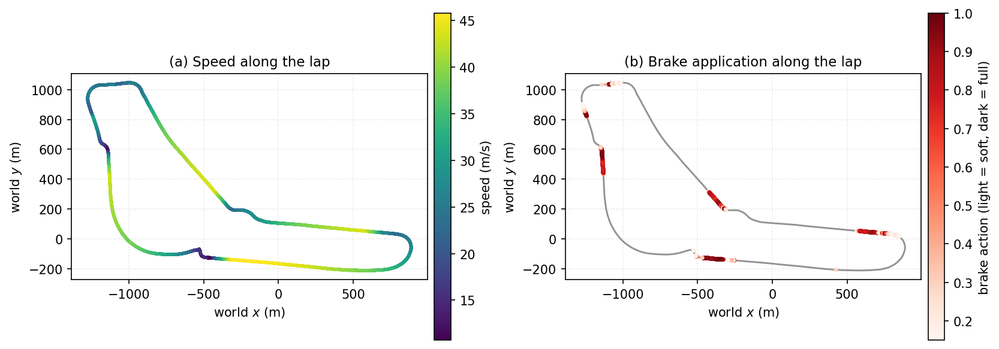
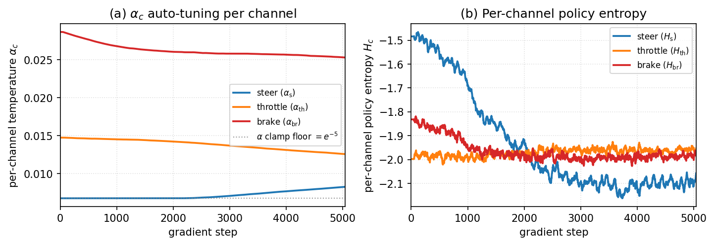
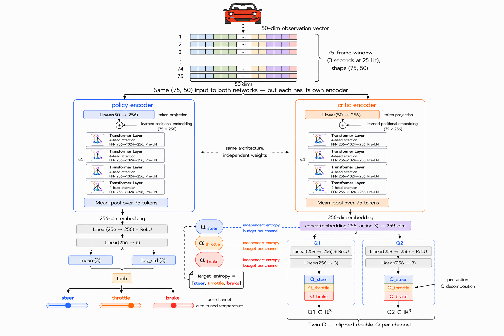

[![Contributors][contributors-shield]][contributors-url]
[![Forks][forks-shield]][forks-url]
[![Stargazers][stars-shield]][stars-url]
[![Issues][issues-shield]][issues-url]

<a id="readme-top"></a>

<div align="center">
  <p align="center" style="font-size: 80px;">🏎️</p>
  <h3 align="center">Vector-Q Transformer SAC for Autonomous Racing in Assetto Corsa</h3>
  <p align="center">
    A single-agent Soft Actor-Critic variant that decomposes the critic and the temperature along the action dimension, combined with a Transformer observation encoder and a behavior-cloning-seeded stratified replay buffer. Trained and evaluated in a live Assetto Corsa session at 25 Hz.
  </p>

  <p align="center">
    <a href="https://youtu.be/ZNJG0orcfXg">
      
    </a>
    <br/>
    <em>Click the clip to watch the full-lap demo on YouTube.</em>
  </p>

  <p align="center">
    <br/>
    <a href="https://github.com/virtual457/transformer-based-autonomous-racing-agent"><strong>Explore the docs</strong></a>
    <br/><br/>
    <a href="https://github.com/virtual457/transformer-based-autonomous-racing-agent">View Repository</a>
    |
    <a href="https://github.com/virtual457/transformer-based-autonomous-racing-agent/issues/new?labels=bug">Report Bug</a>
    |
    <a href="https://github.com/virtual457/transformer-based-autonomous-racing-agent/issues/new?labels=enhancement">Request Feature</a>
  </p>
</div>

<details>
  <summary>Table of Contents</summary>
  <ol>
    <li><a href="#about-the-project">About The Project</a></li>
    <li><a href="#key-contributions">Key Contributions</a></li>
    <li><a href="#results">Results</a></li>
    <li><a href="#technical-architecture">Technical Architecture</a></li>
    <li><a href="#model-architecture">Model Architecture</a></li>
    <li><a href="#training-pipeline">Training Pipeline</a></li>
    <li><a href="#behavioral-cloning-pipeline">Behavioral Cloning Pipeline</a></li>
    <li><a href="#getting-started">Getting Started</a></li>
    <li><a href="#usage">Usage</a></li>
    <li><a href="#project-structure">Project Structure</a></li>
    <li><a href="#roadmap">Roadmap</a></li>
    <li><a href="#built-with">Built With</a></li>
    <li><a href="#contributing">Contributing</a></li>
    <li><a href="#contact">Contact</a></li>
  </ol>
</details>

## About The Project

Scalar Soft Actor-Critic assigns a single scalar Q-value and a single scalar entropy temperature `α` to the joint action. In racing this is a poor match for the task: the three action channels (steer, throttle, brake) are physically coupled but causally distinct, and components of the reward give opposing signals on different channels in the same frame (for example, applying brake when the car is slow deserves a penalty while applying throttle in the same state deserves a reward).

This project replaces those three single-number quantities with per-channel vectors:

- a **per-channel vector reward** that preserves opposing signals instead of averaging them away,
- a **per-channel Q-critic** that lets each action dimension receive its own credit gradient,
- a **per-channel auto-tuned temperature** `α_c` with an independent target entropy per channel,
- a **Transformer observation encoder** over a 3-second (75-frame) window so the policy sees the corner-approach history, and
- a **6-channel stratified FIFO replay buffer** seeded with 18,497 behavior-cloning demonstration windows so the critic has a usable expert gradient before online training begins.

All of this runs against a live Assetto Corsa session via the `assetto_corsa_gym` plugin stack, with control sent back to the game through vJoy at 25 Hz.

<p align="right">(<a href="#readme-top">back to top</a>)</p>

## Key Contributions

1. **Vector-Q critic decomposition** — the scalar critic head is replaced by `Q(s,a) = [Q_s, Q_th, Q_br]`, trained against per-channel Bellman targets. Each output neuron receives a gradient from its own channel-specific reward, so a frame with correct brake and incorrect throttle no longer penalises the brake head.
2. **Per-channel temperature** — the scalar `α` is replaced by `(α_s, α_th, α_br)`, each auto-tuned against its own target entropy. Steering runs with a looser entropy target, throttle and brake run with tighter ones. Across training, the three channels reach clearly separated equilibria that a scalar `α` cannot simultaneously satisfy.
3. **Transformer observation encoder** — 4 Pre-LN layers, 4 heads, `d_model = 256`, over a 75-frame window. Policy and critic use independent encoder copies to avoid joint-embedding collapse.
4. **Stratified replay with BC seeding** — six sub-buffers (positive / negative per action channel) of capacity `10^5` each, warm-started with 18,497 human-driven demonstration windows so the critic has shape before online training begins.

Full mathematical formulation and experimental details are in [`main.tex`](docs/paper/main.tex) / the compiled report.

<p align="right">(<a href="#readme-top">back to top</a>)</p>

## Results

Evaluated on the full Monza circuit in Assetto Corsa with a Mazda Miata.

| metric | MLP SAC baseline | Vector-Q Transformer SAC | Δ |
|---|---|---|---|
| Lap completion rate | 0% | **80%** | +80 pp |
| Mean distance / episode (m) | 619 | **3,862** | 6.2× |
| Best episode distance (m) | 1,539 | **5,774** | 3.8× |
| Speed mean (m/s) | 19.9 | **28.8** | 1.4× |
| Speed max (m/s) | 43.1 | 44.1 | ≈ |
| Mean |gap| (m) | 0.48 | 0.52 | ≈ |
| Reward / frame | +0.27 | **+0.64** | 2.4× |
| Positive-reward frames (%) | 97 | 97.9 | ≈ |

Both policies track the racing line with comparable per-frame lateral precision (~0.5 m) and reach similar top speeds on the frames they actually drive; the difference is in **persistence** — the Vector-Q policy sustains good driving for 6.2× the distance and completes full laps on the majority of evaluation runs, whereas the scalar-SAC baseline never completed a lap.

<p align="center">
  
  <br/>
  <em>Full-lap evaluation on Monza. (a) trajectory coloured by per-frame speed; (b) trajectory coloured by per-frame brake action — five to six distinct braking zones, each aligned with a named Monza corner.</em>
</p>

Per-channel auto-tuning reaches clearly separated equilibria (`α_brake ≫ α_throttle ≫ α_steer`, roughly 3.5× spread), and the per-channel Q-values on positive vs. negative sub-buffers show ratios of ~4.7× on all three heads, indicating the decomposition is balanced rather than collapsed.

<p align="center">
  
  <br/>
  <em>Per-channel α auto-tuning reaches distinct equilibria on each action channel, with steer pinned near the clamp floor and brake settling ≈3.5× higher. A scalar α cannot simultaneously satisfy this spread.</em>
</p>

<p align="right">(<a href="#readme-top">back to top</a>)</p>

## Technical Architecture

```text
+----------------------------------------------------------------------+
|                    LIVE ASSETTO CORSA TRAINING LOOP                  |
|                                                                      |
|   Assetto Corsa <-> Plugin / Socket Layer <-> Our Environment        |
|           ^                            |                    |        |
|           |                            v                    v        |
|        vJoy Control         75-frame Window Builder   Per-Channel    |
|        (steer/thr/br)              (3s @ 25Hz)        Reward Vector  |
|                                          |                  |        |
|                                          v                  v        |
|                             Transformer Encoder x2 (policy + critic) |
|                                          |                  |        |
|                                          v                  v        |
|                              Diag-Gaussian     Clipped-double        |
|                              policy head       vector-Q head         |
|                              + per-ch α_c      [Q_s, Q_th, Q_br]     |
|                                                                      |
|   6-channel stratified replay (10^5 per bin)                         |
|       + 18,497 BC-demo windows seeded into positive sub-buffers      |
+----------------------------------------------------------------------+
```

<p align="right">(<a href="#readme-top">back to top</a>)</p>

## Model Architecture

<p align="center">
  
</p>

### Observation and action space

- Observation token `o_t ∈ R^50` per frame (car-state channels, ray casts to the track boundary, OOT flag, curvature look-ahead, past-action history).
- Window `O_t ∈ R^(75 × 50)` — 75 tokens = 3 seconds at 25 Hz.
- Action `a_t ∈ [-1, 1]^3` — continuous steer, throttle, brake, tanh-squashed diagonal Gaussian.

### Transformer encoder

- 4 Pre-LN Transformer layers, 4 heads, `d_model = 256`, feed-forward width 1024.
- Learned positional embedding over 75 positions, mean-pooling over the sequence.
- Policy and critic use **independent** encoder copies to prevent joint-embedding collapse.

### Heads

- **Policy head**: `256 → 256 → 6` (3 means + 3 log-stds).
- **Twin-Q vector head**: `(256 + 3) → 256 → 3` per Q-network, clipped double-Q.
- **Per-channel `α_c`**: three scalar parameters, each `α_c = exp(log α_c)` clamped to `log α_c ∈ [-5, 0]`, auto-tuned against target entropy `(−2, −3, −3)`.

### Parameter budget

- Total: ~6.6M parameters.
- ~97% concentrated in the two Transformer encoders; policy and twin-Q heads add ~200k.
- A matched MLP SAC baseline on a single-frame observation has ~0.44M parameters — the encoder accounts for essentially all of the additional capacity (a ~15× increase), purchased for the 3-second temporal context.

<p align="right">(<a href="#readme-top">back to top</a>)</p>

## Training Pipeline

### High-level loop

```python
while training:
    collect_rollouts_from_assetto_corsa()   # 25 Hz telemetry + vJoy control
    push_transitions_to_stratified_replay() # 6 sub-buffers (pos/neg per channel)
    sample_balanced_minibatches()           # uniform across sub-buffers
    update_vector_critic()                  # per-channel Bellman targets
    update_actor_with_per_channel_alpha()   # sum_c α_c log π_c − Q_c
    auto_tune_each_alpha()                  # channel-wise dual update
    polyak_update_targets()
    checkpoint_and_log()
```

### Training stages

1. **Warm start** — positive sub-buffers are seeded with 18,497 human-driven BC demonstration windows so the critic sees expert trajectories before the first gradient step.
2. **Online training** — SAC continues to collect new transitions, push them into the stratified buffer, and update. The BC data is never re-injected.
3. **Fine-tune** — a separate `_fineTune` variant resumes from a pre-FT checkpoint with tighter `α` targets and harder corner-focused replay sampling.

### Optimisation

- Adam, `3 × 10^{-4}`
- Discount `γ = 0.992`
- Polyak `τ = 0.005`
- Batch size 256
- Clipped double-Q with target Q computed on the sampled next action

### Why this pipeline matters

Racing policies are sensitive to three pressure points: reward shaping, early-exploration collapse, and temporal context. Each architectural choice here targets one of those explicitly — the vector reward and vector Q keep channel-level credit alive, the BC seed and stratified replay prevent the critic from drowning in easy-straight positive rewards, and the Transformer encoder removes the temporal-context burden from the value function.

<p align="right">(<a href="#readme-top">back to top</a>)</p>

## Behavioral Cloning Pipeline

Human driving traces are preprocessed into windowed demonstration datasets before online RL starts. Demonstrations are used for:

- warm-starting the critic on the expert racing line (via injection into the positive sub-buffers),
- validating reward shaping against human behavior,
- comparing pure RL against demonstration-bootstrapped training.

### Included components

- `assets/human_data/collect_human.py`
- `assets/human_data/preprocess_human.py`
- `src/AICLONE/preprocess_parquet.py`
- `src/AICLONE/pretrain_actor.py`
- `src/AICLONE/generate_target_speed.py`
- `src/AICLONE/finetune_on_demo.py`

<p align="right">(<a href="#readme-top">back to top</a>)</p>

## Getting Started

### Prerequisites

**Hardware**
- NVIDIA GPU recommended for training
- 16 GB RAM recommended
- Windows 10/11

**Software**
- Assetto Corsa
- Content Manager
- Python 3.12
- vJoy

### Installation

```bash
# 1. Clone the repository
git clone https://github.com/virtual457/transformer-based-autonomous-racing-agent.git
cd transformer-based-autonomous-racing-agent

# 2. Create a local environment
python -m venv AssetoCorsa
AssetoCorsa\Scripts\activate

# 3. Install dependencies
pip install -r src/assetto_corsa_gym/requirements.txt
```

Install the CUDA-compatible PyTorch build for your GPU if required.

### Simulator setup

You will need to configure:

- the Assetto Corsa plugin files from `src/assetto_corsa_gym/`
- the vJoy controller profile
- the simulator environment and telemetry flow

Helpful references:

- [src/assetto_corsa_gym/README.md](src/assetto_corsa_gym/README.md)
- [src/assetto_corsa_gym/INSTALL.md](src/assetto_corsa_gym/INSTALL.md)
- [src/assetto_corsa_gym/INSTALL_Linux.md](src/assetto_corsa_gym/INSTALL_Linux.md)

<p align="right">(<a href="#readme-top">back to top</a>)</p>

## Usage

### Train the Vector-Q Transformer SAC agent (shipped model)

```bash
AssetoCorsa\Scripts\python.exe gym\transformer_sac_vectorq_v2_final_fineTune\train.py --manage-ac
```

### Train the baseline MLP SAC agent

```bash
AssetoCorsa\Scripts\python.exe gym\sac\train_sac.py --manage-ac
```

### Train an intermediate Transformer SAC variant (scalar-Q, scalar-α)

```bash
AssetoCorsa\Scripts\python.exe gym\transformer_sac\train.py --manage-ac
```

### Prepare human data

```bash
AssetoCorsa\Scripts\python.exe human_data\preprocess_human.py
```

### Behavioral cloning preprocessing

```bash
AssetoCorsa\Scripts\python.exe AICLONE\preprocess_parquet.py
```

### Validate environment lifecycle

```bash
AssetoCorsa\Scripts\python.exe tests\test_ac_lifecycle.py
```

<p align="right">(<a href="#readme-top">back to top</a>)</p>

## Project Structure

```text
transformer-based-autonomous-racing-agent/
|
|-- README.md                    This file
|
|-- src/                         All source code
|   |-- gym/                                              RL environment, SAC variants, rewards
|   |   |-- sac/                                          MLP SAC baseline
|   |   |-- transformer_sac/                              Transformer + scalar Q + scalar α
|   |   |-- transformer_sac_finetune/                     Scalar-Q Transformer + fine-tune
|   |   |-- transformer_sac_vectorq/                      First Vector-Q variant
|   |   |-- transformer_sac_vectorq_v2/                   Second Vector-Q variant
|   |   |-- transformer_sac_vectorq_v2_final/             Pre-fine-tune Vector-Q variant
|   |   |-- transformer_sac_vectorq_v2_final_fineTune/    Shipped model
|   |   |-- telemetry/                                    Telemetry parsing and environment support
|   |   |-- rewards/                                      Reward components and composition
|   |-- AICLONE/                 Behavioral cloning and offline preprocessing
|   |-- collectDataAI/           Agent rollout collection utilities
|   |-- assetto_corsa_gym/       Assetto Corsa plugin and integration layer
|   |-- eval/                    Evaluation scripts
|   |-- tests/                   Setup and validation scripts
|
|-- assets/                      Data, checkpoints, outputs
|   |-- human_data/              Human driving collection and preprocessing
|   |-- collected_data/          Collected agent rollout data
|   |-- data/                    Processed datasets
|   |-- checkpoints/             Model checkpoints
|   |-- trained_models/          Final trained models
|   |-- outputs/                 Training outputs
|   |-- results/                 Evaluation outputs and reports
|   |-- reward_log/              Reward logs
|
|-- docs/                        Documentation, paper, figures, demo
|   |-- paper/                   NeurIPS-style technical report source (main.tex)
|   |-- figures/                 Figures used in the technical report
|   |-- demo/                    Offline inference demo notebook and assets
```

<p align="right">(<a href="#readme-top">back to top</a>)</p>

## Roadmap

### Completed
- [x] Live Assetto Corsa integration at 25 Hz
- [x] MLP SAC baseline
- [x] Transformer observation encoder
- [x] Vector-Q critic decomposition
- [x] Per-channel auto-tuned temperature
- [x] Stratified replay with BC demonstration seeding
- [x] 80% lap-completion evaluation on Monza
- [x] NeurIPS-format technical report

### In progress
- [ ] Corner-specific curriculum (targeted re-collection at Variante della Roggia)
- [ ] Per-component matched-compute ablations
- [ ] Tighter evaluation of lap consistency and control smoothness

### Planned
- [ ] Reward-sensitive auto-α (state-conditioned target entropy based on per-channel advantage)
- [ ] Multi-track generalisation to test whether Vector-Q gains survive track-level distribution shift
- [ ] Critic ensembles composed with the per-channel Q architecture

<p align="right">(<a href="#readme-top">back to top</a>)</p>

## Built With

### Core ML
* [PyTorch](https://pytorch.org/) - Deep learning and policy training
* [CUDA](https://developer.nvidia.com/cuda-toolkit) - GPU acceleration

### RL and Data Tooling
* [NumPy](https://numpy.org/) - Numerical computation
* [Pandas](https://pandas.pydata.org/) - Data handling
* [SciPy](https://scipy.org/) - Scientific computing utilities

### Simulator and Control
* [Assetto Corsa](https://www.assettocorsa.it/) - Racing simulator
* [vJoy](https://sourceforge.net/projects/vjoystick/) - Virtual controller interface
* [assetto_corsa_gym](https://github.com/dasGringuen/assetto_corsa_gym) - Integration base for simulator communication

<p align="right">(<a href="#readme-top">back to top</a>)</p>

## Contributing

Contributions are welcome. Helpful areas include:

- per-component matched-compute ablations
- reward-sensitive auto-α implementation and validation
- multi-track evaluation
- corner-specific curriculum design
- critic ensembles and uncertainty-driven exploration
- documentation and reproducibility improvements

If you want to contribute:

1. Fork the project
2. Create a feature branch
3. Commit your changes
4. Push the branch
5. Open a pull request

<p align="right">(<a href="#readme-top">back to top</a>)</p>

## Contact

**Chandan Gowda K S**
- Email: chandan.keelara@gmail.com
- LinkedIn: [Chandan Gowda K S](https://www.linkedin.com/in/chandan-gowda-k-s-765194186/)
- Portfolio: [virtual457.github.io](https://virtual457.github.io/)

**Project Link**: [https://github.com/virtual457/transformer-based-autonomous-racing-agent](https://github.com/virtual457/transformer-based-autonomous-racing-agent)

<p align="right">(<a href="#readme-top">back to top</a>)</p>

<!-- MARKDOWN LINKS & IMAGES -->
[contributors-shield]: https://img.shields.io/github/contributors/virtual457/transformer-based-autonomous-racing-agent.svg?style=for-the-badge
[forks-shield]: https://img.shields.io/github/forks/virtual457/transformer-based-autonomous-racing-agent.svg?style=for-the-badge
[stars-shield]: https://img.shields.io/github/stars/virtual457/transformer-based-autonomous-racing-agent.svg?style=for-the-badge
[issues-shield]: https://img.shields.io/github/issues/virtual457/transformer-based-autonomous-racing-agent.svg?style=for-the-badge
[contributors-url]: https://github.com/virtual457/transformer-based-autonomous-racing-agent/graphs/contributors
[forks-url]: https://github.com/virtual457/transformer-based-autonomous-racing-agent/network/members
[stars-url]: https://github.com/virtual457/transformer-based-autonomous-racing-agent/stargazers
[issues-url]: https://github.com/virtual457/transformer-based-autonomous-racing-agent/issues
